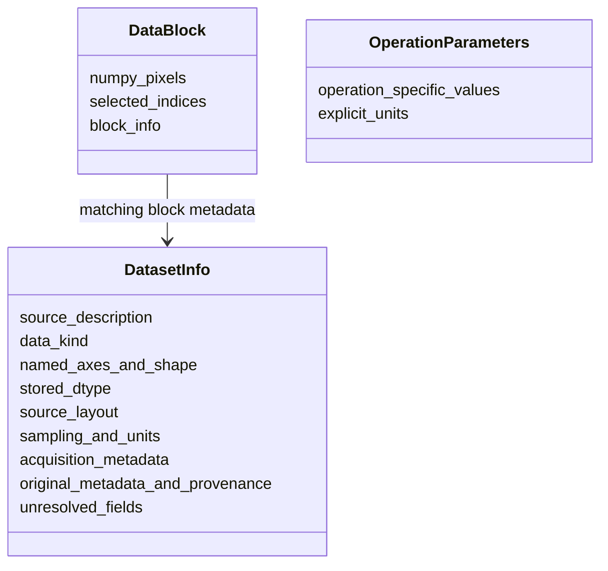

# Proposed UML data flow

**Version 1.0** Git versions revisions. Architecture approval is pending. These Unified Modeling Language (UML) diagrams explain the [proposed design](library-design.md); they do not approve function signatures, format contracts, or scientific algorithms.

## Main pipeline: conversion and reconstruction are separate routes

The first MRC slice converts harmonized image data to modern MRC output without calling reconstruction or requiring optical transfer function (OTF) calibration. A caller requesting reconstruction takes a separate route through the numerical stage. The historical placeholder is superseded by the separately approved [known-parameter first-harmonic 2D contract](../contracts/known-parameter-reconstruction-v1.md), with [public usage](../usage/reconstruction.md) and [actual comparison](../reports/reconstruction-comparison.md). Its owner-authorized candidate is stacked above verified, independently reviewed, unmerged calibration PR #7; exact candidate verification/review and owner integration remain pending. The broader 3D/adaptor flow below remains architectural context.

```mermaid
sequenceDiagram
    actor Caller as Python caller or command-line user
    participant Input as Input adapters
    participant Pure as Pure harmonization
    participant Numeric as reconstruct(images, explicit keywords)
    participant Output as Output adapters

    Caller->>Input: Inspect image source
    Input-->>Caller: Dataset description and recorded metadata
    Caller->>Pure: Resolve metadata overrides and acquisition profile
    Pure-->>Caller: Resolved description or validation error

    alt Convert: first MRC slice
        Caller->>Output: Begin modern MRC output
        loop Selected image blocks
            Caller->>Input: Read selected stored pixels
            Input-->>Caller: Decoded pixels and source indices
            Caller->>Pure: Harmonize block axes and metadata
            Pure-->>Caller: Harmonized image block
            Caller->>Output: Write image block
        end
        Caller->>Output: Finalize metadata and close file
        Output-->>Caller: Output file and conversion report
    else Reconstruct: separate numerical route
        Caller->>Input: Read image acquisition unit and OTF calibration
        Input-->>Caller: Image and frequency-domain calibration data
        Caller->>Pure: Harmonize image and OTF independently
        Pure-->>Caller: Image unit and OTF with resolved axes and units
        Caller->>Numeric: Image unit, OTF calibration, explicit parameters
        alt Invalid inputs or specified numerical failure
            Numeric--xCaller: Explicit error; no partial result
            Note over Caller,Output: No reconstructed result is available to write
        else Contracted 2D candidate
            Note over Numeric: Pure numerical functions; no file access
            Numeric-->>Caller: Reconstruction2D signed complex arrays and sampling
            Caller->>Output: Write reconstructed result
            Output-->>Caller: Output file and reconstruction write report
        end
    end
```

Input and output functions in the broad pipeline diagram describe responsibilities. The concrete 2D candidate consumes plain `(R,N,Ny,Nx)` arrays, a matching `Otf2D` and all required explicit keyword parameters. It composes public `separate_phases` per orientation, Fourier-series bands, closed-axis interpolation, complex transfer weighting and explicit ridge/mask. It returns independently owned signed complex image/spectrum and frequency axes at half spacing and unchanged field. This pure numerical operation performs no file I/O; no reconstruction adapter or CLI command is introduced.

Conversion is complete only when its output and report are produced. Reconstruction has its own [task evidence pointer](../tasks/known-parameter-reconstruction.md) and independent acceptance requirements. Neither `read`, `harmonize`, `write`, nor the CLI conversion path calls `reconstruct` implicitly. Conversion output remains image data of its original kind; it is not labeled as reconstructed data.

## First MRC slice: inspect, resolve, and convert

The sequence diagram reads from top to bottom. Arrows carry requests or returned data. The Python caller and command-line interface use the same public functions. Input/output adapters perform file access; harmonization operates on explicit values.

```mermaid
sequenceDiagram
    actor User as Python caller or command-line user
    participant API as Public functions
    participant Input as Input adapter
    participant Pure as Pure harmonization
    participant Output as Output adapter

    User->>API: inspect(source)
    API->>Input: Read headers, extended metadata, and payload description
    Note over Input: Open source, inspect, close; no pixel loading
    Input-->>API: DatasetInfo: recorded metadata and unresolved fields
    API-->>User: DatasetInfo for inspection

    User->>API: harmonize(info, overrides, acquisition profile)
    API->>Pure: Resolve layout and units; apply explicit overrides
    Note over Pure: Retain original values and record every override
    Pure-->>API: Resolved DatasetInfo or explicit validation error
    API-->>User: Resolved info or fields that need correction

    alt Required layout or schema remains unknown, or payload is inconsistent
        Note over User,Output: Inspection is available; conversion does not start
    else Metadata and payload description are consistent
        User->>API: write(destination, source description, selection)
        API->>Output: Begin modern MRC output with documented metadata
        loop Selected pixel blocks until conversion completes
            API->>API: read(source, selected region, resolved info)
            API->>Input: Decode selected stored pixels
            Note over Input: File resources remain scoped to the read call
            Input-->>API: Decoded pixels and source indices
            API->>Pure: Harmonize block axes and attach resolved metadata
            Pure-->>API: DataBlock: NumPy pixels plus matching metadata
            API->>Output: Encode and write this block
        end
        API->>Output: Finalize output metadata and close file
        Output-->>API: Write result or explicit I/O error
        API-->>User: Output location and conversion report
    end
```

This illustrates a streamed file-to-file conversion. A Python caller can instead call `read` to obtain one selected `DataBlock`, inspect or process that block, and pass it to `write`. Caller-supplied NumPy arrays enter through `harmonize` with explicit metadata; they do not need a file adapter. Function argument lists above illustrate data dependencies, not settled signatures.

An output handle necessarily exists during a write call, and scratch arrays may be reused inside a call. These are local implementation resources. No long-lived reconstruction session, open handle in a data record, or changing global parameter object is proposed. The loop bounds pixel memory by selected blocks; it does not make a later whole-volume reconstruction automatically bounded-memory.

## Data records: values, not processing engines

The class diagram shows fields and associations. It describes small value records even though the proposed operations are functions. It introduces no stateful image-processing class or method-based workflow.



- `DatasetInfo` can describe spatial image data or frequency-domain optical transfer function (OTF) data. Its data kind, axes, and units distinguish them. A header filename alone does not choose the interpretation.
- `DataBlock` contains only the selected pixels and their corresponding metadata/index selection. A small dataset descriptor does not imply that the whole acquisition is loaded.
- `OperationParameters` illustrates future per-operation parameter records. Parameters remain separate inputs; no generic all-algorithm settings object or new executable parameter API is approved.
- Metadata records are treated as values. This does not make NumPy buffers deeply immutable. Pure functions must not mutate caller-owned arrays.

## Reconstruction detail: concrete 2D candidate and future 3D context

The concrete 2D operation is defined by the linked contract and usage above. The
following broader 3D diagram is future architectural context; it supplies no 3D
implementation, estimation or adapter authorization.

The proposed numerical data flow is:

```mermaid
sequenceDiagram
    actor Caller
    participant Intake as Same intake functions
    participant Numeric as Future 3D numerical operation
    participant Writer as Same output functions

    Caller->>Intake: Select one channel and time point's raw 3D acquisition
    Intake-->>Caller: Image unit with required Z, orientation, and phase data
    Caller->>Intake: Read and harmonize OTF calibration independently
    Intake-->>Caller: Frequency-domain calibration with declared axes and units
    Caller->>Numeric: Image unit, OTF calibration, explicit algorithm parameters
    Note over Numeric: Future 3D context; concrete candidate currently accepts 2D acquisition arrays
    Numeric-->>Caller: Reconstructed spatial image and result metadata
    Caller->>Writer: Write result through selected output adapter
    Writer-->>Caller: Output file and write report
```

The 3D processing unit contains all required phase/orientation exposures for one channel/time point. It is not one arbitrary input/output block. Future scientific contracts settle transform working sets, scratch staging, and valid subdivisions. Reconstruction, OTF generation/estimation, and scientific defaults remain outside the first file-intake slice.

Modern MRC preserves full logical-axis metadata in a documented extended header. The initial ImageJ path uses the reader support actually established by its contract; it may expose a flattened stack. Preservation is not a promise that ImageJ interprets X/Y/Z/channel/time automatically. A later adapter or reader integration addresses that goal; see the [compatibility evidence](library-design.md).
