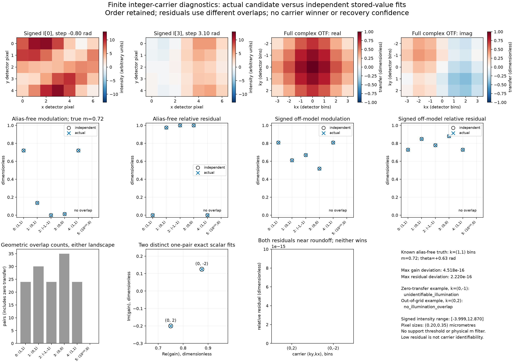

# Measured finite-carrier comparison

The actual candidate exposes the caller-ordered fit landscape. The alias-free
fixture recovers its supplied carrier's gain; the two distinct one-pair carriers
both fit exactly. These measurements establish no ranking or recovery guarantee.
The [usage example](../usage/carrier-scan.md) and
[contract](../contracts/carrier-scan-v1.md) define the public interpretation.



The figure has 2720 by 1920 actual chart pixels. The two signed input panels share
the fixed intensity range [-13,13] arbitrary units; both transfer panels share
[-1,1]. Candidate modulation and residual panels share [-0.025,1.025] dimensionless
limits. Black open circles are independent expectations; blue crosses are actual
outputs. Candidate index, signs, duplicate and failure positions remain unchanged.
The separate one-pair residual axis is [0,1e-14]. Its zero-height bars correspond to
actual computed zero residuals, not missing data. JSON retains unrounded scalars,
all input images and phases, full signed complex calibration and corrected phases.

## Inputs and independent expectations

The accepted `tests/carrier_fixture.py` constructs a real asymmetric specimen with
Fourier-series DC 3 and modes (1,0): 0.32+0.11i; (0,1): -0.27+0.19i;
(1,-1): 0.13-0.08i, plus their conjugates. Positive-sign finite Fourier synthesis
and negative-sign direct finite transforms use index-zero spatial origin. The
detector is 5 by 7 pixels with spacing (dy,dx)=(0.2,0.35) micrometres. The explicit
full complex OTF is
`H(ky,kx)=0.55+0.15*exp(-2*pi*i*ky/5)+0.30*exp(-2*pi*i*kx/7)`;
the source label is retained verbatim as `  independent finite-sum calibration  `.
Frequency axes are centered signed modes divided by the respective physical field
of view, in cycles per micrometre. Calibration origin is explicitly (0,0).

Relative steps are [-0.8,0.17,1.6,3.1,4.7] rad. Brightness is 1.3; known carrier is
(1,1) bins; modulation is 0.72; common phase is +0.63 rad. Their analytic gain is
0.2908899029923747+0.212092112859217i. Inputs are native float64, and stored-value
roundoff is part of the comparison problem. The off-model variant adds harmonics
on (0,1), (-1,-1), (0,0), and a second temporal harmonic at one pixel. It has signed
intensity range [-3.9987092446544956,12.86960968061226]. It has no single physical
carrier truth; the primary injected component retains the stated parameters.

Independent expectations use exact rational least squares on the represented
float64 observations and trigonometric matrix, followed by separate direct finite
Fourier sums and normalized complex scalar regression. Neither production phase
separation, FFT, calibration nor illumination fitting supplies expected values.
On this host NumPy longdouble has float64 range/precision; no extra precision is
claimed for the direct transform. Accepted fixture analytic checks and fresh B's
independent oracle assessment precede this implementation.

## Alias-free landscape, in supplied order

| Index | Carrier (y,x), bins | Actual m | Actual theta, rad | Actual residual | Pairs | Local failure |
|---|---|---|---|---|---|---|
| 0 | (1, 1) | 0.72 | +0.63 | 3.6436063074e-16 | 24 | — |
| 1 | (0, 1) | 0.135954018734 | +0.267673095041 | 0.975714759589 | 30 | — |
| 2 | (-1, -1) | 1.52199650981e-16 | +0.212201232391 | 1 | 24 | — |
| 3 | (0, 0) | 0.0119635094271 | -2.22948138142 | 0.999759822881 | 35 | — |
| 4 | (1, 1) | 0.72 | +0.63 | 3.6436063074e-16 | 24 | — |
| 5 | (10^100,0) | — | — | — | 0 | no_illumination_overlap |

| Index | Independent gain, real + imaginary | Independent residual | Gain deviation | Residual deviation | Informative |
|---|---|---|---|---|---|
| 0 | 0.290889902992 +0.212092112859i | 5.09860064697e-16 | 5.551e-17 | 1.455e-16 | True |
| 1 | 0.0655562763712 +0.0179791109571i | 0.975714759589 | 1.430e-17 | 2.220e-16 | False |
| 2 | 1.76969661366e-17 +3.33107459164e-17i | 1 | 5.927e-17 | 1.110e-16 | False |
| 3 | -0.00366129762367 -0.004730358249i | 0.999759822881 | 5.123e-17 | 0.000e+00 | False |
| 4 | 0.290889902992 +0.212092112859i | 5.09860064697e-16 | 5.551e-17 | 1.455e-16 | True |
| 5 | no_illumination_overlap | — | — | — | — |

The true candidate's gain differs from analytic truth by about 6e-17. The wrong-sign
gain is near computed zero; its phase is unstable (circular deviation about 0.87 rad)
and carries no informative-regime digit promise. There is no hidden weak-support
threshold: its finite computed fit is still reported. All geometric counts include
zero-transfer pairs. Index 4 repeats index 0 with independently allocated phases.

## Signed off-model landscape, in supplied order

| Index | Carrier (y,x), bins | Actual m | Actual theta, rad | Actual residual | Pairs | Local failure |
|---|---|---|---|---|---|---|
| 0 | (1, 1) | 0.808449744732 | +0.523285396721 | 0.728322033514 | 24 | — |
| 1 | (0, 1) | 0.611599981947 | -0.389432575543 | 0.848893652128 | 30 | — |
| 2 | (-1, -1) | 0.668711944183 | +2.3976912535 | 0.77889594218 | 24 | — |
| 3 | (0, 0) | 0.517964227468 | +0.246165755839 | 0.880413703998 | 35 | — |
| 4 | (1, 1) | 0.808449744732 | +0.523285396721 | 0.728322033514 | 24 | — |
| 5 | (10^100,0) | — | — | — | 0 | no_illumination_overlap |

| Index | Independent gain, real + imaginary | Independent residual | Gain deviation | Residual deviation | Informative |
|---|---|---|---|---|---|
| 0 | 0.350132328888 +0.202002722027i | 0.728322033514 | 1.755e-16 | 1.110e-16 | True |
| 1 | 0.282903106303 -0.116101106471i | 0.848893652128 | 1.001e-16 | 1.110e-16 | True |
| 2 | -0.246029916743 +0.226413771977i | 0.77889594218 | 1.618e-16 | 0.000e+00 | True |
| 3 | 0.25117481417 +0.0631106010165i | 0.880413703998 | 5.722e-17 | 1.110e-16 | True |
| 4 | 0.350132328888 +0.202002722027i | 0.728322033514 | 1.755e-16 | 1.110e-16 | True |
| 5 | no_illumination_overlap | — | — | — | — |

Every off-model expected fit satisfies the selected informative prerequisites. The
maximum permitted absolute gain/residual budget here is
`8192*5*35*2^-52=3.183231456205249e-10` (gain uses max(1,abs(z))).
The residuals describe first-harmonic model mismatch and differing overlaps; they
are not solver error or confidence probabilities. No candidate is selected.

## Separate ambiguity and local outcomes

The accepted one-pair construction uses a 1 by 3 unit-transfer detector, the same
steps and spacings, DC Fourier coefficients [0.4,0.2,0.4] and positive-harmonic
coefficients [0.35+0.05i,0,0.3-0.08i]. Its signed images range from
-1.0822779660685473 to 2.2914111379264486 arbitrary units. The two analytic gains are
0.75-0.20i and 0.875+0.125i. Both fit one informative pair exactly. Their modulation
exceeds one, which is an accepted diagnostic result.

| Index | Carrier (y,x), bins | Actual m | Actual theta, rad | Actual residual | Pairs | Local failure |
|---|---|---|---|---|---|---|
| 0 | (0, 2) | 1.55241746963 | -0.260602391747 | 0 | 1 | — |
| 1 | (0, -2) | 1.76776695297 | +0.141897054604 | 0 | 1 | — |

| Index | Independent gain, real + imaginary | Independent residual | Gain deviation | Residual deviation | Informative |
|---|---|---|---|---|---|
| 0 | 0.75 -0.2i | 0 | 2.289e-16 | 0.000e+00 | True |
| 1 | 0.875 +0.125i | 0 | 4.518e-16 | 0.000e+00 | True |

The 1 by 2 fixture with transfer [0,1] returns, in order, `(0,-1)`:
`unidentifiable_illumination`, one geometric pair; `(0,2)`:
`no_illumination_overlap`, zero pairs. An all-zero 5 by 7 acquisition returns
`(1,1)`: `unidentifiable_illumination`, 24 pairs, then `(10^100,0)`:
`no_illumination_overlap`, zero pairs. Both calls return their complete tuples.

Across the two landscapes and ambiguity example the maximum absolute gain deviation
is **4.518280359883027e-16**, and maximum residual deviation is
**2.220446049250313e-16**. The PNG markers, counts and annotations
come directly from these JSON fields. Caller arrays were compared before/after each
execution and remained unchanged. This is measured fixture correspondence, not a
proof for every input or a complete verification verdict.

## Reproduction and provenance

Numerical execution used the worktree `.venv/bin/python`: Python 3.13.12,
NumPy 2.5.3 and SciPy 1.18.1 on macOS arm64. The independent expectations and actual
public scan both ran there. Rendering alone used the existing
`miniconda3/bin/python`: Python 3.13.12, Matplotlib 3.11.0, Agg backend, with
`MPLCONFIGDIR` under ignored execution artifacts. It consumed numerical JSON only;
it imported no product runtime and recalculated no fits. No dependency was added.
Absolute executable/environment identities remain in local evidence.

Commands from the worktree:

```sh
.venv/bin/python artifacts/carrier-execution/C-comparison.py
# Use the existing report-only Matplotlib interpreter:
python artifacts/carrier-execution/C-plot.py
.venv/bin/python artifacts/carrier-execution/C-write-comparison-report.py
```

The plotting command's `python` denotes that separately recorded report-only
interpreter, not the bundled runtime. Generators, actual JSON/logs and environment
manifest are local ignored evidence under `artifacts/carrier-execution/`.
The usage document's Python block was separately executed by the worktree interpreter.

| Input / artifact | SHA256 |
|---|---|
| accepted tests/test_carrier.py | `a1d0b4c9549154251286cfde8b7ca9ada741501e1fba2ad220c078feb14bb008` |
| accepted tests/carrier_fixture.py | `9a007187d4f53f9c414f6b52e981c7203fd66c90b9204dc264dd45111511bd4e` |
| uv.lock | `e6ff14aa7d6c2108292aaef624d150f48876954ff3989e1bc3955ef2aa1ddb2b` |
| C-comparison.py | `9bcf5e30144d79d2d042ff50a782144e721cdff5c6825efc284a3622c7c4f83e` |
| C-comparison.json | `995f8262f67b48edd69a245daf994dae98eb2dc2dd7e7917ab886ef91a310eee` |
| C-plot.py | `417da14cdf789ee760158b4362f235a719b8af5ac3e6463768e0605f34bbdc56` |
| docs/figures/carrier-scan-comparison.png | `63387be4f649e9701cc7610e5a34e5e106ee1359a12b9c46065a1e459931d8cc` |

The numerical JSON records source-file identities and the working state of its
execution. The final committed candidate, exact full verification receipt and fresh
D verdict belong outside tracked bytes to the task's execution record. This report
makes no preemptive gate or integration claim.

Different overlaps, sparse information, noise, aliases, periodic specimens and
model mismatch can defeat physical recovery. There is no support threshold, ranking,
tie rule, confidence or modulation-domain filter. Robust selection and continuous
search remain separate work. The diagnostic completes only the contracted finite
integer scan.
