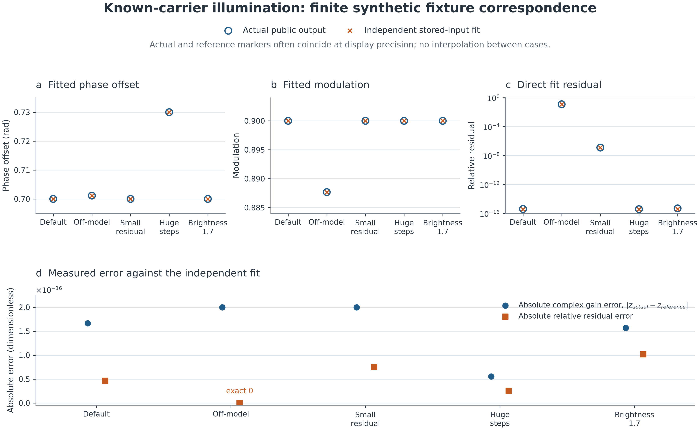
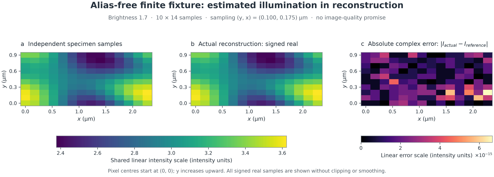

# Illumination estimation: measured independent comparison

These are actual public-entry measurements of `estimate_illumination` and
`reconstruct` on the accepted independent fixture. They measure numerical
correspondence for these finite synthetic arrays. They establish no general
image-quality, noise-reliability or physical recovery claim. Exact candidate and
canonical verification evidence belong to the coordinator's execution record;
this report is not the full gate or independent D verdict.



**Figure 1. Finite synthetic fit correspondence.** Open circles show actual
public outputs; crosses show the independent fit to the stored observations.
The markers often coincide at display precision. Phase offset is in radians;
modulation and relative residual are dimensionless. Phase and modulation use
linear axes; the positive direct residual uses a logarithmic axis. The lower
linear axis shows absolute complex gain error for `z=(m/2)*exp(i*theta)` and
absolute residual error, including the exact zero for the off-model residual
error. The off-model reference is its stored-input fit, not its generating
parameters. Residual describes model fit, not confidence. The gain/residual
acceptance budgets are `3.8198777474462986e-10` (six steps) and
`5.093170329928398e-10` (eight steps); the small-residual assertion additionally
requires error below `2e-12`. These budgets do not apply directly to phase.



**Figure 2. Alias-free finite reconstruction correspondence.** The brightness-1.7
case feeds its actual estimated phases and modulation into the public
reconstruction operation. The independently sampled continuous specimen and
the actual signed real image share one linear intensity scale. The third panel
shows `abs(actual_complex_image-independent_specimen)` on its own linear scale
in intensity units, including the imaginary component; its maximum is
`6.661360429966720e-15`. Each panel shows all `(10,14)` output pixels without
smoothing or clipping. Pixel centres start at `(y,x)=(0,0)` micrometres, with
sampling `(0.1,0.175)` micrometres and y increasing upward. The equal physical
axis scale uses pixel-edge bounds x `[-0.0875,2.3625]` and y `[-0.05,0.95]`
micrometres; the last centres are x `2.275` and y `0.9` micrometres. This is
correspondence for the accepted finite fixture, with no general image-quality,
noise-reliability or physical recovery promise.

The [plot data and provenance manifest](../references/scientific/illumination-estimation-comparison.json)
contains the actual/reference scalars, complete plotted arrays, shapes, dtypes,
C-order array digests, frozen input/checkpoint/source identities, numerical and
rendering environments, generator/renderer digests and final PNG digests.

The [contract](../contracts/illumination-estimation-v1.md) defines the operation.
The independent fixture in `tests/illumination_fixture.py` generates observations
by explicit periodic convolution and computes truth with a 90-digit Decimal
phase solve on stored float64 observation/trigonometric entries, followed by
explicit signed finite Fourier sums and complex regression. Expected values
never call production separation, estimation or reconstruction. On this platform
NumPy longdouble has 53 significant bits; the Fourier oracle's extended dtype
provides no extra precision. B4 independently checked the oracle with 100-digit
Decimal Fourier/QR calculations before freezing the tests.

## Inputs and conditioning

The default specimen is
`3 + 0.35*cos(2*pi*x/7) + 0.2*sin(2*pi*y/5) + 0.17*cos(2*pi*(y/5+x/7))`.
The detector shape is `(5,7)` at `(0.2,0.35)` micrometres. The origin is `(0,0)`;
the kernel has masses `3/8` at zero, `1/8` at `+y`, and `1/2` at `+x`.
Its signed complex OTF source is retained verbatim:
`" independent signed complex finite kernel "`.
Carrier `(1,-1)` bins corresponds to `(1.0,-0.4081632653061225)` cycles per
micrometre. There are `(5-1)*(7-1)=24` closed-grid overlap pairs.

Default steps are `[-2.4,-0.8,0.25,1.1,2.5,3.7]` radians. Generating modulation
is `0.9`, common offset `0.7` radians and brightness `1.0`. The off-model input
adds `0.16*(p+1)*cos(2*pi*(y/5-2*x/7))`. The small-residual input is the default
plus `1e-6` times the stored off-model/default difference. Huge steps are
`[1e20,-1e20,1e100,-1e100,1e200,-1e200,1e300,-1e300]` radians, with generating
offset `0.73`. Reconstruction uses the same model at brightness `1.7`.

Truth below is the estimator for the **stored observations**, including rounding,
rather than an assertion that off-model data recovers the generating parameters.
The residual at roundoff scale in the default model is distinct from the
off-model discrepancy and from the measured error against the oracle.

| Input | Phase condition | norm(x)/B | norm(y)/B | Correlation magnitude |
| --- | ---: | ---: | ---: | ---: |
| Default | 1.6630817125 | 0.3851700074 | 0.1733265033 | 1.0000000000 |
| Off-model | 1.6630817125 | 0.3741448777 | 0.1673811059 | 0.9921073564 |
| Small residual | 1.6630817125 | 0.3851700043 | 0.1733265017 | 0.999999999999992 |
| Huge steps | 2.1537725404 | 0.3867123017 | 0.1740205358 | 1.0000000000 |
| Brightness 1.7 | 1.6630817125 | 0.3851700074 | 0.1733265033 | 1.0000000000 |

Here `B` is the maximum absolute converted image value. Every row independently
qualifies for the informative regime: condition <=10, both norm ratios >=1/8,
correlation >=1/4, and gain magnitude between `1e-4` and `10`. The gain and
residual absolute budget is `8192*N*35*2^-52`: `3.8198777474462986e-10` for six
steps and `5.093170329928398e-10` for eight steps. These are project acceptance
budgets. The small-residual test also requires error below `2e-12`.

## Actual public outputs

| Input | Actual offset (rad) | Oracle offset (rad) | Actual modulation | Oracle modulation |
| --- | ---: | ---: | ---: | ---: |
| Default | 0.7000000000000003 | 0.7000000000000001 | 0.8999999999999999 | 0.9000000000000001 |
| Off-model | 0.7011458697329267 | 0.7011458697329269 | 0.8876776692286071 | 0.8876776692286076 |
| Small residual | 0.7000000011442005 | 0.7000000011442005 | 0.8999999986884770 | 0.8999999986884774 |
| Huge steps | 0.7300000000000002 | 0.7300000000000001 | 0.8999999999999999 | 0.9000000000000000 |
| Brightness 1.7 | 0.7000000000000003 | 0.7000000000000002 | 0.9000000000000001 | 0.8999999999999998 |

| Input | Actual residual | Oracle residual | Absolute gain error | Absolute residual error |
| --- | ---: | ---: | ---: | ---: |
| Default | 4.083015408669818e-16 | 3.615329605166101e-16 | 1.6653e-16 | 4.6769e-17 |
| Off-model | 0.12539136096837275 | 0.12539136096837275 | 2.0015e-16 | 0 |
| Small residual | 1.261751020930481e-7 | 1.261751021680854e-7 | 2.0015e-16 | 7.5037e-17 |
| Huge steps | 3.836510441226845e-16 | 3.578340885490463e-16 | 5.5511e-17 | 2.5817e-17 |
| Brightness 1.7 | 4.960894924579953e-16 | 3.940692230315296e-16 | 1.5701e-16 | 1.0202e-16 |

Gain error compares `0.5*modulation*exp(i*offset)` against the independent complex
gain. All rows return overlap count 24 and the unchanged source. Default
corrected phases are approximately
`[-1.7,-0.1,0.95,1.8,-3.083185307179586,-1.883185307179586]` radians.
Huge-step corrected phases are
`[0.02864784228465483,1.4313521577153456,0.33951415680787445,1.1204858431921259,0.03032547182296562,1.4296745281770347,-1.4538724841522326,2.913872484152233]`.
They come from represented rotations, with no huge-angle addition or rounded
modulo reduction. Accepted circular phase assertions pass.

For the brightness-1.7 fixture, the actual estimated phases and modulation feed
`reconstruct` with the explicit wavevector above, brightness `[1.7]`, ridge `0`
and unit `(10,14)` amplitude mask. The independently sampled doubled-grid
specimen and its finite-sum spectrum give:

| Reconstruction measurement | Value |
| --- | ---: |
| Maximum absolute complex image error | 6.661360429966720e-15 intensity units |
| Maximum absolute complex spectrum error | 1.4670112292562475e-15 Fourier-series intensity units |
| Maximum absolute imaginary image component | 4.3626724777186944e-17 intensity units |
| Actual signed real image range | [2.376968942647354, 3.623031057352638] intensity units |
| Output shape; sampling | (10,14); (0.1,0.175) micrometres |

The accepted integration tolerance is `2e-10` for both image and spectrum. This
specimen's shifted support is alias-free and the OTF has no zeros. The
correspondence applies to this fixture; it is not an arbitrary-data guarantee.
The separate above-one modulation test confirms estimation stays unconstrained
while reconstruction keeps its physical domain.

## Exact input identities

SHA-256 identities of the accepted files:

```text
tests/test_illumination.py
43a64dd7d3dfb7a3ef104c6b2bb36092812a858c83958ccfcccbead25bb7e707
tests/illumination_fixture.py
93e5ed362c320e2469da323aad354592630e2d69d2abbaeebcb73771be6864f7
docs/contracts/illumination-estimation-v1.md
1726777b2736ece3484fe8f65db2b50fe6d1833c401bf43c040ccd9c0c5d3bb2
```

Array identities hash C-order stored bytes, with shape/dtype recorded here.
All images are `(6,5,7), <f8` except huge-step `(8,5,7), <f8`.

| Image input | SHA-256 |
| --- | --- |
| Default | `6d54a2feb996003a4ce39011b81cdbd4c5ea5905a07ec9aed3a9fab732467ba8` |
| Off-model | `c4243e32ea4fab2aa1d9034b10950d23ed37194e850598ae2f83248ecc714dd4` |
| Small residual | `132fc79470765d7fab8c426f3010803199321f4268f9e156cac4ab3896c1c007` |
| Huge steps | `ac83cce5632cbbd43b4438b3bcb6ed5b96a52ec77f19d1590f6fd371e25badd2` |
| Brightness 1.7 | `f514303ad86e3417f5d79985bfac4fd87fd39c9c82cd109f4ba3f6112bb622f1` |

```text
default steps (6,), <f8:
0f739b74f96b9ae2dae0b9b9da05b2fbf8188441a89a2711b30ebd0f9aa7bb69
huge steps (8,), <f8:
ca3a50cec3a8b87892d8c3d9dcd313137c2d68a84fbb2a5307b22117fb40d441
shared transfer (5,7), <c16:
20fdd1cc64d2696c915ba9f94f24f6e981c5fd8d356b44ff1eb829078c2e0553
detector specimen (5,7), <f8:
e360d1496d67df6263af86b8b74758170ab846e6d02a5b7c9195addcc9b988e4
doubled specimen (10,14), <f8:
e2c9738194e0382a753dbf2d97c348d75937052af41a8e32f1e0396cff02076a
doubled finite-sum spectrum (10,14), <c16:
ccd7074a3f3aeb4ac43f61df0c8576d1007fd78aa0a2dc1bbadc5d221e21463b
```

## Reproduction and environment

Measured from the repository root on macOS 27.0 arm64: Python 3.13.12,
NumPy 2.5.3, SciPy 1.18.1. Use the existing worktree `.venv`; no plotting or
other dependency was added to the project. The following command reproduces the
numerical comparison and input digests using the accepted fixture:

```sh
.venv/bin/python - <<'PY'
import hashlib
import sys
sys.path.insert(0, "tests")
import numpy as np
from illumination_fixture import acquisition, stored_fit, grid, continuous_specimen, finite_dft
from simrecon import Otf2D, estimate_illumination, reconstruct

base, off = acquisition(), acquisition(off_model=True)
small = acquisition()
small.images[...] = base.images + 1e-6 * (off.images - base.images)
huge = acquisition(steps=np.array([1e20,-1e20,1e100,-1e100,1e200,-1e200,1e300,-1e300]),
                   theta=0.73)
for name, f in [("default", base), ("off-model", off), ("small-residual", small),
                ("huge-steps", huge), ("reconstruction", acquisition(brightness=1.7))]:
    fy, fx = grid(f.transfer.shape, f.pixel_size)
    otf = Otf2D(f.transfer, fy, fx, f.pixel_size, f.origin, f.source)
    fit = estimate_illumination(f.images, otf=otf, phase_steps_rad=f.steps,
                                carrier_bins_yx=f.carrier)
    truth = stored_fit(f.images, f.steps, f.transfer, f.carrier)
    gain = 0.5 * fit.modulation * np.exp(1j * fit.phase_offset_rad)
    print(name, fit, truth, "errors", abs(gain-truth.gain),
          abs(fit.relative_residual-truth.residual))
    for array in (f.images, f.steps, f.transfer, f.specimen):
        print(array.shape, array.dtype.str, hashlib.sha256(array.tobytes(order="C")).hexdigest())
    if name == "reconstruction":
        ny, nx = f.transfer.shape
        dy, dx = f.pixel_size
        wave = np.array([[f.carrier[0]/(ny*dy), f.carrier[1]/(nx*dx)]])
        r = reconstruct(f.images[None], otf=otf, phases_rad=fit.phases_rad[None],
                        wavevectors_per_um=wave, modulation=np.array([fit.modulation]),
                        brightness=np.array([f.brightness]), regularization=0.,
                        apodization=np.ones((2*ny, 2*nx)))
        expected = continuous_specimen((ny, nx))
        spectrum = finite_dft(expected).astype(np.complex128)
        print("reconstruction", np.max(np.abs(r.image-expected)),
              np.max(np.abs(r.spectrum-spectrum)), np.max(np.abs(r.image.imag)),
              r.image.real.min(), r.image.real.max(), r.pixel_size_um)
        for array in (expected, spectrum):
            print(array.shape, array.dtype.str, hashlib.sha256(array.tobytes(order="C")).hexdigest())
PY
```

The figures were rendered separately with Matplotlib 3.11.2, NumPy 2.5.3 and
Pillow 12.3.0, the noninteractive Agg backend and bundled DejaVu Sans font.
Both PNGs use 300 dots per inch: Figure 1 is `3600 x 2220` pixels; Figure 2 is
`3840 x 1380` pixels. Numerical generation uses the project interpreter;
rendering reads the persisted manifest and imports no product or fixture code.
The presentation-only generators are retained as ignored local evidence under
`artifacts/illumination-execution/figures/`, not shipped runtime tools. Their
exact hashes and portable commands are in the manifest. The executed commands
from the repository root are:

```sh
.venv/bin/python artifacts/illumination-execution/figures/generate.py
MPLBACKEND=Agg MPLCONFIGDIR=artifacts/illumination-execution/figures/mplconfig \
  uv run --offline --no-project --python .venv/bin/python \
  --with matplotlib==3.11.2 --with numpy==2.5.3 \
  python artifacts/illumination-execution/figures/render.py
```

The offline rendering command uses an already populated external uv cache.
The numerical example above remains reproducible without the ignored scripts;
the tracked manifest also retains every plotted value for independent replotting.

Focused execution: `.venv/bin/python -m pytest --tb=short -q tests/test_illumination.py`
passed all 189 tests with no skips. Owned-source Ruff lint/format checks and the
project Pyright check pass. Canonical clean `make verify`, native coverage/report
integrity, isolated wheel/audit checks and fresh D review remain coordinator work.
