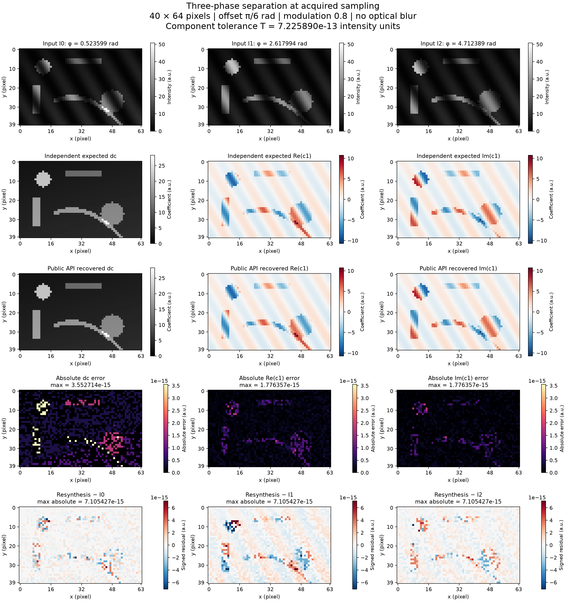

# Actual three-phase separation comparison



This figure shows actual `simrecon.separate_phases` output from A's frozen
`analytic_phantom()` fixture. It is phase separation at the acquired sampling.
The object and observations are noiseless analytic intensities with no optical
blur or camera model. No high-resolution reconstructed image is shown.

The fixture has shape **40 × 64 pixels** in `(y, x)` order, three phases,
offset **π/6 rad** (stored float64 `0.52359877559829882`), modulation
**0.8**, carrier **(0.071, −0.043) cycles/pixel** in `(x, y)` order and origin
**0.37 rad**. Intensities use arbitrary units (a.u.). Pixels increase rightward
in x and downward in y. The fixture declares

```text
theta = 2*pi*(0.071*x - 0.043*y) + 0.37
phi_p = pi/6 + 2*pi*p/3
I_p = A*(1 + 0.8*cos(theta + phi_p))
analytic dc = A
analytic c1 = 0.8*A*exp(i*theta)/2
```

The asymmetric object is `2+x/64+2*y/40`, plus disks at `(12,9)` with radius
4 pixels and intensity 19, and `(48,27)` with radius 6 pixels and intensity 11;
bars `7<=x<11, 19<=y<34` with intensity 14 and `24<=x<43, 5<=y<8` with intensity
9; and the curve `|y-(25+0.022*(x-27)^2)|<=1.2, 18<=x<55` with intensity 13.

Expected panels use the fixture's unchanged `expected_dc` and `expected_c1`
arrays. These derive from its independent 120-digit Decimal oracle applied
to actual stored float64 observations, rounded once to float64 components.
`analytic_dc` and `analytic_c1` separately describe the generating signal.
Recovered panels use the public API; product output supplies no expected value.
See the [frozen fixture](../../tests/phase_separation_fixture.py),
[public contract](../contracts/known-phase-separation-v1.md) and
[usage](../usage/phase-separation.md).

## Scales and measured errors

All three raw panels share grayscale `[0, 50.847677656722645]` a.u. The expected
and recovered dc panels share grayscale `[0, 28.318749999999991]` a.u. All four
signed real/imaginary panels share the zero-centred diverging scale
`[−10.748357976257742, +10.748357976257742]` a.u.; blue is negative and red positive.
All three absolute component-error maps share `[0, 3.5527136788005009e-15]` a.u.
All three signed residual maps share `[−7.1054273576010019e-15, +7.1054273576010019e-15]`
a.u. No error is clipped and no panel uses an independent scale.

For `M=max(abs(images))=50.847677656722645` a.u., the public component tolerance is
`T=64*2^-52*M+8*2^-1074=7.225889597851e-13` a.u. The tests separately
allow `1.01*T` against the rounded stored expected arrays. Direct analytic
comparisons include observation-generation rounding.

| Component | Maximum absolute error vs stored expected (a.u.) | Maximum absolute error vs analytic (a.u.) |
|---|---:|---:|
| dc | 3.552713679e-15 | 1.776356839e-14 |
| Re(c1) | 1.776356839e-15 | 8.881784197e-15 |
| Im(c1) | 1.776356839e-15 | 1.376676551e-14 |

All three residuals use the actual returned arrays in
`dc+2*Re(c1*exp(i*phi_p))-I_p`. This is a consistency check alongside the
independent component truth. The fixture's resynthesis bound is `5*T`, or
`3.612944798926e-12` a.u.

| Input | Maximum absolute resynthesis residual (a.u.) |
|---|---:|
| I0 | 7.105427358e-15 |
| I1 | 7.105427358e-15 |
| I2 | 7.105427358e-15 |

## Reproduction and provenance

Actual command, run from the worktree root:

```sh
MPLBACKEND=Agg MPLCONFIGDIR=artifacts/nf02/mplconfig .venv/bin/python artifacts/nf02/render_comparison.py
```

The one-off renderer, comparison arrays and environment details are local
ignored evidence under `artifacts/nf02/`; they are not a shipped reporting
API. It imports this worktree's public API and frozen test fixture, then
appends the prepared external plotting environment to its Python search path.
Rendering used Python 3.13.12, NumPy 2.5.3,
Matplotlib 3.11.0 and Pillow 12.3.0, with the
Agg backend. No plotting dependency was added to the project.

Array identities include shape, little-endian dtype and contiguous bytes,
using the fixture's `array_identity` function:

| Frozen array | SHA-256 |
|---|---|
| `images` | `d2f5496b8d62b99c42c8ce7ac0bd21377bbc0ad0a686e587d1af43f8d2840cb2` |
| `expected_dc` | `29ffa4b795a93705d105d4dd0d066f43ae116e0b2f71c59c93a89b506c42de52` |
| `expected_c1` | `749735b59e411207e33ac0477e08fc97c1d45a466ee6db9aed7a866d4f47185d` |
| `analytic_dc` | `2c5455db5625204180ba58bcf3f955ad3329e0acc7a97000d456f1b180aa6b05` |
| `analytic_c1` | `0524689a5df457ea7facb12b566f7bfffc1a425394e0e1dc869625bd4f77098e` |
| `theta_rad` | `66ffb23dadd68e9d96b64a4be04360bd1b3a12971bbfcb9bed2b48cf7eda52be` |

The [local ignored provenance sidecar](../../artifacts/nf02/provenance.json)
records renderer/source/figure identities, recovered-array identities and
external environment paths. The coordinator must fill its final candidate
commit and exact-candidate canonical verification fields after committing.
Those final identities and check results stay outside the tracked report.
The sidecar and renderer are local evidence and may be absent in a clean clone;
the frozen fixture, API and equations identify the comparison inputs.
