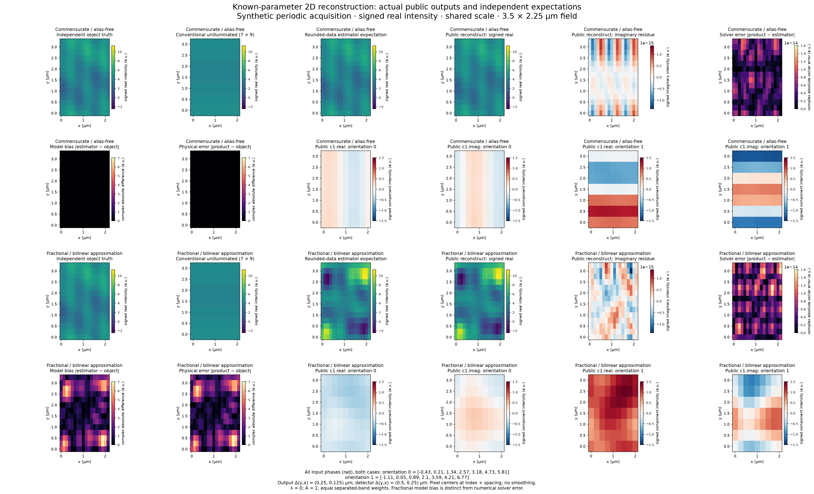

# Actual known-parameter reconstruction comparison

The public reconstruction matches the frozen independent rounded-data estimator
in both examples. The fractional example also shows a large physical-model bias:
its estimator differs from object truth by **7.032280227474114 arbitrary intensity
units**. This example statistic is neither an acceptance threshold nor a universal
interpolation bound. Candidate review, exact committed full verification and owner
integration remain pending for this stacked implementation.



The [machine-readable manifest](../references/scientific/reconstruction-comparison.json)
contains the full actual image/spectrum, independent expected arrays, acquisitions,
PSF/OTF, all parameters, public phase components, maxima and provenance. Expectations
come from the B4-accepted independent
[fixture](../references/scientific/reconstruction-fixtures-v1.json), never from
product outputs. Its embedded historical “not yet B accepted” label describes its
creation; the accepted checkpoint and verdict hash in the comparison manifest
identify the later acceptance. The [contract](../contracts/known-parameter-reconstruction-v1.md)
and [usage](../usage/reconstruction.md) define interpretation and limits.

Each case occupies two figure rows. Truth, conventional unilluminated observation,
rounded-data estimator and actual signed real image share the same intensity
scale across both cases: `[-2.4650974759686655, 11.333757096506593]` arbitrary units.
There is no display normalization. Conventional observation is the independent
native `7 × 9` unit-brightness unilluminated acquisition, not a phase average.
Diagnostics show signed imaginary residue, full complex absolute solver error,
full complex model bias and physical error, and actual public `c1.real`/`c1.imag`
for both orientations. Component planes are actual preprocessing outputs, not
independent component truth.

Samples have coordinates `(y*dy,x*dx)` with index-zero origin. The figure uses
lower origin, nearest-pixel display without smoothing, and half-pixel extents
`[-dx/2,Nx*dx-dx/2,-dy/2,Ny*dy-dy/2]` µm. Pixel centers therefore retain those
sample coordinates, including zero. Detector spacing is `(0.5,0.25)` µm; output
spacing is `(0.25,0.125)` µm and shape is `14 × 18`. Both cover the same
`3.5 × 2.25` µm field. Doubled sampling is not a general measured-optics resolution
claim. Axis labels, intensity units, all 14 input phases and sampling are visible
in the PNG. Imaginary and solver-error maps use scales of approximately
`1.38e-15` and `1.60e-14` units, respectively; these amplified diagnostics are
separate from the shared intensity scale.

## Independent model and explicit parameters

Both cases use the same asymmetric real Fourier object, with coefficients
`S(0,0)=4`, `S(1,0)=0.25+0.4i`, `S(0,3)=-0.35+0.2i`, and
`S(2,1)=0.15-0.3i`; negative modes are conjugates. The independent finite-sum
oracle evaluates roots and the stored-data estimator with 85 decimal digits.
The synthetic acquisition uses periodic circular convolution on the detector.
The analytic nonnegative unit-discrete-mass PSF is

```text
h[y,x] = (1+0.8*cos(2*pi*(y-1)/7))
         *(1+0.6*cos(2*pi*(x-1)/9)+0.2*cos(4*pi*(x-1)/9))/63
```

Its declared kernel origin is `(0,0)`. The one-sample displacement in both axes
is already encoded in the original full complex supplied OTF. No replacement
calibration is generated. There is no background correction, recentering,
pixel-area factor or measured-instrument claim. The transfer has 15 exactly
nonzero detector bins, at `|jy| <= 1`, `|jx| <= 2`; zero bins remain zero without a
support threshold. Object modes `(0,3)` and `(2,1)` have zero DC transfer but are
recovered through sidebands in the commensurate alias-free example.

All phases, in radians, are supplied directly in acquisition order:

```text
orientation 0: [-0.43, 0.21, 1.34, 2.57, 3.18, 4.73, 5.81]
orientation 1: [-1.11, 0.05, 0.89, 2.10, 3.59, 4.21, 6.77]
```

Brightness is `[0.75,1.5]`; modulation is `[0.625,0.875]`. Both cases have
`lambda=0` and an explicit unit `14 × 18` amplitude mask `A=1`. Weights are equal
in separated-band coordinates. There is no ridge/window bias in these examples.

| Case | Signed bin shifts `(sy,sx)` | Wavevectors `(ky,kx)`, cycles/µm |
|---|---|---|
| Commensurate | `(0,1)`, `(1,0)` | `(0,0.4444444444444444)`, `(0.2857142857142857,0)` |
| Fractional | `(0.5,0.5)`, `(-0.5,0.5)` | `(0.14285714285714285,0.2222222222222222)`, `(-0.14285714285714285,0.2222222222222222)` |

Both queries and transfer use closed-axis complex bilinear interpolation; outside
queries are exact zero without wrapping, extrapolation or a partial stencil.
Fractional positioning approximates sampled spectra. The finite noncommensurate
acquisition therefore need not recover object truth, even with zero ridge and a
unit mask.

## Full-array numerical measurements

Errors below are calculated from full complex arrays before display rounding.
Coordinate error is the maximum over separate real and imaginary coordinates;
the acceptance ratio is that error divided by the coordinate budget. Complex
modulus is an additional descriptive measurement, with conservative bound
`sqrt(2)*budget`. Physical/model differences are separate from both.

| Measurement, arbitrary intensity units unless a ratio | Commensurate | Fractional |
|---|---:|---:|
| Image solver max coordinate error | 1.0658141036401503e-14 | 1.5987211554602254e-14 |
| Image solver max complex modulus error | 1.0668261996603705e-14 | 1.6003765244874455e-14 |
| Spectrum solver max coordinate error | 1.6716848403035003e-15 | 2.525757381022231e-15 |
| Spectrum solver max complex modulus error | 1.8321544404118382e-15 | 2.9021835616977607e-15 |
| Coordinate budget | 7.982644463363716e-08 | 8.019466820278505e-08 |
| Image coordinate / budget ratio | 1.3351641909290784e-07 | 1.9935504333250725e-07 |
| Spectrum coordinate / budget ratio | 2.094149185743753e-08 | 3.149532802648986e-08 |
| Product versus object max complex error | 9.787950992599273e-15 | 7.032280227474119 |
| Estimator versus object max complex bias | 6.217248937900877e-15 | 7.032280227474114 |
| Actual max imaginary residue | 1.0090806467885548e-15 | 1.3827530569683348e-15 |
| Actual signed real minimum | 1.7110768856002165 | -2.4650974759686632 |
| Actual signed real maximum | 6.288923114399775 | 11.33375709650659 |

The commensurate estimator/object difference reflects finite stored acquisitions
and rounded expectations. It is distinguished from the fractional physical
approximation bias. Negative fractional reconstruction values and all imaginary
residues are retained, without clipping or real forcing.

Both examples satisfy the informative regime: phase matrix condition numbers
are `1.792268649991335` and `1.7358914277842479`, and both gains lie in `[0.1,10]`.
The denominator measurements are independent effective-transfer values before
ridge, not values inferred from product reconstruction.

| Denominator/support measurement | Commensurate | Fractional |
|---|---:|---:|
| `min(V)` | 0 | 0 |
| Smallest positive `V` | 8.789062500000001e-05 | 5.493164062500001e-06 |
| `max(V)` | 2.9602001953125 | 2.9685284592473935 |
| Positive / zero modes of 252 | 31 / 221 | 35 / 217 |

Smallest positive denominators exceed `1e-6*max(1,max(V),lambda)` in each case.
Exactly unsupported output modes remain zero. This eligibility check establishes
application of the project budget, not complete behavior or physical correctness.

| Mode / case | Actual spectrum | Independent estimator |
|---|---|---|
| `(0,3)`, commensurate | `-0.3499999999999999+0.19999999999999973i` | `-0.3500000000000002+0.19999999999999982i` |
| `(2,1)`, commensurate | `0.14999999999999988-0.2999999999999997i` | `0.1499999999999998-0.2999999999999998i` |
| `(0,3)`, fractional | `0.10693496608103821+0.1180568780439612i` | `0.10693496608103797+0.11805687804396116i` |
| `(2,1)`, fractional | `-0.37262407503200856-0.5221505028780675i` | `-0.37262407503200834-0.5221505028780679i` |

## Provenance and reproducibility

The frozen B4 checkpoint is
`B4:82bcbfe1a41cc5d0439e89d0dbb0bebf7e5b315b37801617cf7b57ed04c8602b`;
the accepted verdict SHA256 is
`fa131979cdab582d43e5b637593706b397ba4fb40062ec676b741034f2045cdd`.
The independent fixture JSON SHA256 is
`64decad0389d332100bee202a02a8bafacd1c942e324dff992babccb8ca88541`.
The manifest records all nine unchanged frozen hashes, actual operation/phase/OTF
source hashes, input acquisition hashes, original independent PSF/OTF and
expectation arrays, generator hashes, plot-input hash, PNG hash and environment
identities. Final committed candidate and full-gate results belong outside tracked
bytes in coordinator evidence.

Product arrays were generated with project Python 3.13.12, NumPy 2.5.3 and SciPy
1.18.1 on macOS arm64, using locked uv 0.12.19. Local longdouble has no wider
exponent range than float64. Plotting used isolated Python 3.13.12, Matplotlib
3.11.2, NumPy 2.5.3, Agg, FreeType 2.14.3 and DejaVu Sans; interpreter and font
hashes are recorded. The transient plotting environment is not a stable executable
path or a product dependency. No product dependency/lock change was made.

Actual commands, with `uv` resolving to the pinned local executable:

```sh
.venv/bin/python artifacts/reconstruction-execution/generate-reconstruction-comparison.py
uv run --no-project --python .venv/bin/python --with matplotlib==3.11.2 --with numpy==2.5.3 python artifacts/reconstruction-execution/plot-reconstruction-comparison.py
```

Both generators and `comparison-product-data.json` are ignored local evidence,
not shipped helpers. Generation verifies frozen inputs, verifies acquisition/OTF/
object correspondence to the independent fixture, and hashes product sources
before and after calls. Plotting rechecks source, checkpoint and generator hashes
and reads the same recorded arrays. The actual PNG pixels were inspected. Any
product-source or comparison-input change requires regeneration and inspection;
these two fixtures do not establish a general interpolation bound, measured
optical resolution or correctness beyond the approved contract.
