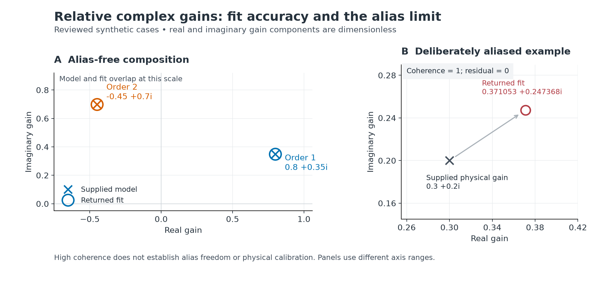
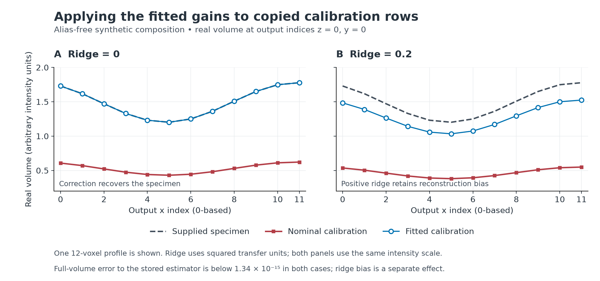

# Measured volume-order gain comparison

This comparison executes the public separator, selected-order estimator and
recombiner. The [numeric JSON](volume-order-gain-comparison.json) retains the
inputs, calibration fields, expected and actual arrays, scalar diagnostics,
array identities, sufficient-precision regime measures and error budgets.
The [contract](../contracts/volume-order-gain-v1.md) defines the behavior.

Expectations use the accepted fixture's exact rational least-squares solution
on represented phase entries and stored observations, followed by 80-digit
Decimal Fourier sums and regression. Each expectation is calculated before
its corresponding runtime call. Reconstruction expectations use the copied
fitted calibration as a stored caller input, before calling the recombiner.
No production numerical output supplies an expected separator, Fourier band,
regression or reconstruction value.

All gains, residuals and coherence values below are dimensionless. Image,
spectrum and volume errors use arbitrary input intensity units. Calibration
frequencies use cycles per micrometre; spacing uses micrometres; supplied
fundamental phases use radians.

Figure 1. The alias-free composition's fitted gains overlap its supplied model
gains at the displayed scale. The deliberately aliased example returns a
different gain despite coherence one and residual zero. High coherence does
not establish alias freedom or physical calibration. The panels use different
axis ranges; all gain components and diagnostics are dimensionless.
[Vector figure](../figures/volume-order-gain-fit.svg).

| Case | Returned gain | Residual | Coherence | Stored-input gain error | Informative regime |
|---|---:|---:|---:|---:|---|
| off model order 1 | 0.559751+0.113307i | 0.144615 | 0.989488 | 5.274E-17 | yes |
| off model order 2 | -0.269544+0.466993i | 0.16797 | 0.985792 | 2.158E-16 | yes |
| huge fundamental steps order 2 | -0.269559+0.467004i | 0.167745 | 0.98583 | 2.834E-16 | yes |
| scaled 1e+150 1e+250 | 0.3+0.2i | 0 | 1 | 8.358E-17 | yes |
| scaled 1e-150 1e-250 | 0.3+0.2i | 0 | 1 | 9.375E-17 | yes |
| scaled 1e+300 1.0 | 0.3+0.2i | 0 | 1 | 4.308E-17 | yes |
| finite components overflowing magnitude | 1.34827e+308+1.34827e+308i | 0 | 1 | 1.004E+293 | no |
| finite underflow fitted | 0+0i | 0 | 1 | 9.909E-633 | no |
| ratio overflow before correlation | 1e+302+2.94054e+285i | 1 | 1e-08 | 8.965E+286 | no |
| direct small residual | 0.4+0.3i | 4.47214e-08 | 1 | 3.113E-16 | yes |
| tiny nonzero correlation | 1e-100+2.94054e-117i | 1 | 1e-100 | 8.788E-116 | no |
| aliased high coherence | 0.371053+0.247368i | 0 | 1 | 1.984E-16 | yes |

The off-model cases have nonzero residual despite high coherence. They fit the
specified projection and do not certify a physical calibration. The order-two
huge-angle case uses the supplied fundamental steps, including `1e308` rad,
without doubling or reducing them.

The three common-scale cases cover images at `1e150`, `1e-150` and `1e300`
intensity units and transfers at `1e250`, `1e-250` and unity. Their independent
norms and budgets remain finite in the Decimal observer. Every informative
case satisfies all five regime requirements, including the conservative phase
condition upper bound, energy lower bounds and `delta = 65536*N*M*2**-52`.
JSON records each inequality's operands, rather than inferring membership
from a passing result.

The remaining extreme cases use explicit case-specific checks. A one-sample
fit returns two finite components near `1.34827e308` even though their complex
magnitude exceeds float64 range; each component ratio error is below `1e-12`.
A two-mode case has a norm ratio above maximum float64, but correlation reduces
the final real gain to about `1e302`; its real ratio error is below `0.005`.
That check makes no uniform relative-accuracy claim for its tiny imaginary
component. The underflow example has both exact scalar components below half
the smallest float64 quantum and returns `0j` with status `fitted`.

The direct-residual example has a residual near `4.47e-8`. Its measured residual
error is below `2e-13`, which distinguishes direct vector subtraction from
subtracting nearly equal squared correlations. The tiny-correlation example
retains a positive correlation below `1e-90` and status `fitted`; its gain
relative error is below `1e-12`. These are distinguishing synthetic checks,
not universal guarantees outside the contract's informative regime.

Two additional structural cases use independently established zero outcomes.
An identically zero DC transfer gives `zero_response`, gain zero, residual zero
and coherence zero. Complementary nonzero DC/Nyquist supports give
`zero_correlation`, gain zero, residual one and coherence zero. Both retain
all geometric pairs. The response-zero diagnostics are the explicit contract
convention, not normalization of zero energy.

The alias-free composition uses a `(2, 4, 8)` detector, carrier `(0, 1)`, seven
unequal fundamental steps and an independently synthesized extended specimen.
Its full complex nominal transfers are asymmetric; the specimen includes
axial and lateral even-Nyquist modes. Both selected-order expectations are
computed independently before fitting. The measured gains are approximately
`0.8+0.35i` and `-0.45+0.7i`; their stored-input errors are below `1.1e-16`.
Their errors against the unrounded model gains are below `2.5e-16`. The second
gain differs from the first gain squared by more than `0.2`.

The caller independently copies all calibration arrays and metadata. Each
correction changes only its selected positive row; row zero and the other
positive row stay equal to their preceding copies. The nominal calibration
stays unchanged. Recombination receives the original fundamental steps and
explicit carrier, unit brightness gain, output `(2, 4, 12)` and unit amplitude
mask. Matching negative transfers follow the recombiner's modular conjugation.
The JSON retains these caller inputs and the corrected calibration.

| Ridge (squared transfer units) | Max spectrum error to stored estimator | Max volume error to stored estimator | Max spectrum error to unrounded specimen |
|---:|---:|---:|---:|
| 0 | 2.90e-16 | 1.34e-15 | 3.03e-16 |
| 0.2 | 1.97e-16 | 1.12e-15 | 0.196946 |

These rows satisfy the independently evaluated recombination informative
regime. Its spectrum budget is `2.16e-8` intensity units; its volume budget is
`2.08e-6` intensity units. JSON includes the positive denominator minimum,
component and phase bounds, floating-range safety measure and conservative
rounding allowance for conversion of Decimal observer arrays to native floats.
Volume errors also meet the tighter case-specific `2e-10` margin. Uncorrected
and corrected spectra differ by more than `0.05` intensity units in both rows.
Positive-ridge bias is separate from gain and stored-input estimator errors.

Figure 2. One stored 12-voxel real-volume profile at output indices `z=0, y=0`
shows the effect of applying the fitted gains to copied calibration rows.
Both panels use the same intensity scale. The zero-ridge corrected profile
overlaps the supplied specimen; positive ridge retains reconstruction bias.
The full-volume error annotation concerns the complex arrays and their stored
estimator expectations, rather than error against the supplied specimen.
[Vector figure](../figures/volume-order-gain-reconstruction.svg).

Both figures plot values from the existing numeric JSON with Matplotlib
3.11.2. They add no simulations or numerical expectations. These finite
synthetic examples do not establish measured-instrument performance.

The deliberately aliased example uses distinct extended transfer weights at
modes zero and four. Detector sampling folds their contributions together.
Its gain is approximately `0.371053+0.247368i`, with coherence one, while the
supplied physical example's gain is `0.3+0.2i`. Detector specimen samples are
constant; doubled-window samples reveal the unresolved extended component.
The stored-input regression remains accurate. High coherence proves neither
alias freedom nor true calibration beyond the excited overlap.

The [standalone usage example](../usage/volume-order-gain.md) also ran. It
explicitly fits and corrects both rows once, with unchanged fundamental steps.
Its reconstructed constant-volume error is `3.20e-15` intensity units.

These are finite synthetic measurements on native macOS with Python 3.13.12,
NumPy 2.5.3 and SciPy 1.18.1. They supply no measured-instrument, practical-size,
resource or cross-platform guarantee. Near-rank-deficient phases, weak
predictors, near-cancelling correlations and arbitrary extreme ratios carry no
uniform digit promise. Full canonical verification, native coverage exports,
wheel/import/audit evidence and fresh independent review remain separate gates.
