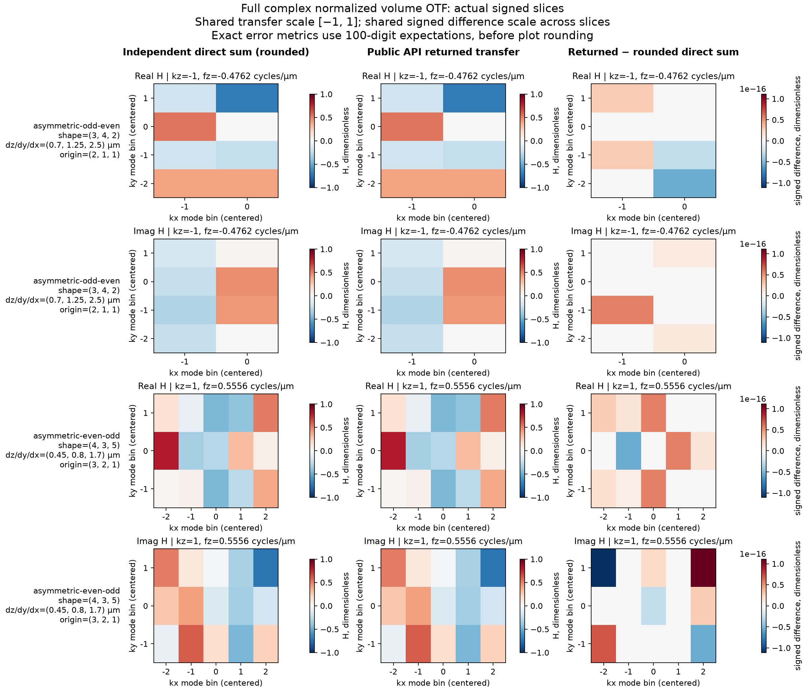

# Measured sampled-volume OTF comparison

All eleven executed cases satisfy the contract’s complex transfer and individual frequency budgets. These are supplemental post-implementation measurements against the B10-accepted independent observer; fresh review and the canonical exact-candidate gate remain separate obligations.

The public call is `prepare_volume_otf(samples, voxel_size_um=spacing, origin_zyx=declared, source=source)`. The retained generator constructs inputs and invokes that entry point using `.venv/bin/python`. No production transform or output supplies the expected values.

The expectation is the negative-sign, normalized full three-dimensional discrete Fourier transform (DFT). The accepted observer uses 100-digit Decimal arithmetic, exact float64 sample values, rational angles and Taylor-series sine/cosine roots. Its analytical root, asymmetric-bin, delta, constant, conversion-tie and range selfchecks passed before comparison. Frequencies use the independent Decimal quotient `k/(N*d)` for exact converted spacing. The expected arrays in NPZ are rounded complex128/float64 copies for inspection; JSON retains the high-precision expectations and errors measured before that rounding.

Input samples have arbitrary intensity units. Normalization makes sample mass sum to one; transfer and complex absolute error are dimensionless. Spacings are in micrometres (µm), frequencies in cycles/µm. Arrays retain z/y/x order. Inputs, returned full spectra and expected full spectra are stored for every case.

| Case | Shape z/y/x | Spacing z/y/x (µm) | Origin z/y/x | Maximum complex error | Absolute budget |
|---|---|---|---|---:|---:|
| asymmetric-odd-even | (3, 4, 2) | (0.7, 1.25, 2.5) | (2, 1, 1) | 5.307E-17 | 6.821E-13 |
| joint-translation | (3, 4, 2) | (0.7, 1.25, 2.5) | (0, 3, 0) | 5.307E-17 | 6.821E-13 |
| asymmetric-even-odd | (4, 3, 5) | (0.45, 0.8, 1.7) | (3, 2, 1) | 7.908E-17 | 1.705E-12 |
| all-maximum | (2, 3, 2) | (0.7, 1.25, 2.5) | (1, 2, 1) | <1e-95 | 3.411E-13 |
| all-subnormal | (2, 3, 2) | (0.7, 1.25, 2.5) | (1, 2, 1) | <1e-95 | 3.411E-13 |
| unequal-subnormal | (1, 1, 2) | (0.7, 1.25, 2.5) | (0, 0, 1) | <1e-95 | 5.684E-14 |
| mixed-maximum-subnormal | (1, 2, 2) | (0.7, 1.25, 2.5) | (0, 1, 1) | <1e-95 | 1.137E-13 |
| near-cancellation | (2, 2, 2) | (0.7, 1.25, 2.5) | (1, 0, 1) | 1.578E-30 | 2.274E-13 |
| frequency-maximum-spacing | (3, 4, 2) | (1.7976931348623157e+308, 1.7976931348623157e+308, 1.7976931348623157e+308) | (2, 1, 1) | 5.307E-17 | 6.821E-13 |
| frequency-small-spacing | (3, 4, 2) | (5.562684646268003e-309, 1.0, 2.0) | (2, 1, 1) | 5.307E-17 | 6.821E-13 |
| singleton-extremes | (1, 1, 1) | (5e-324, 1.7976931348623157e+308, 5e-324) | (0, 0, 0) | 0.000E-294 | 2.842E-14 |

Here `eps=2^-52`, `q=2^-1074`, and the per-bin transfer budget is `128*M*eps+4*M*q`, with `M` the voxel count. For the largest volume, `M=4*3*5=60`; its budget is `128*60*2^-52+240*q = 1.7053025658e-12`. The measured maximum is `7.9075982951e-17`. Residuals below `1e-95` are at the observer’s precision floor and do not establish that level of product accuracy.

The comparison covers 195 complex transfer samples and 80 frequency coordinates. Every frequency meets `abs(error)<=8*eps*abs(exact)+q`, with exact zero DC, finite ordered coordinates and nonzero nonzero modes. Full per-coordinate expectations, errors and budgets are retained in JSON. Maximum spacing avoids intermediate `N*d` overflow; small spacing `2^-1024` gives large but representable frequencies. Singleton spacing includes both q and the maximum finite float64 value. `all-maximum` uses that maximum as every sample; `all-subnormal` uses q. Mixed-scale and near-cancellation cases use the exact stored-input problem.

The first two rows jointly translate PSF and origin by `(1,-2,1)` on a periodic grid. Their returned arrays differ by exactly zero in this run. Nonzero origins in both asymmetric cases expose signed complex phase. These examples are nonseparable: their occupied voxels and weights cannot be a product of independent one-axis kernels.

The figure shows real and imaginary slices at `kz=-1` for `(3,4,2)` and `kz=1` for `(4,3,5)`. Expected and returned transfers share the scale `[-1,1]`; every signed difference panel shares `[-1.1102230246251565e-16,1.1102230246251565e-16]`. Horizontal/vertical labels are centered integer mode bins. Slice titles give axial frequency in cycles/µm; row labels give shape, spacing and origin. Plot differences subtract the rounded expected array. The table uses the original high-precision expectation, so the two error displays need not match numerically.

Numerical generation ran on macOS arm64, Python 3.13.12, NumPy 2.5.3 and installed SIMrecon metadata version 0.1.0. Host `longdouble` has 52 mantissa bits and minimum exponent -1022. Saved arrays were plotted separately with Python 3.13.12, Matplotlib 3.11.0 and plotting-only NumPy 2.5.1; the plotting interpreter ran no product calculation. Figure size is 14×12 inches at 160 dpi. Plotting uses an ignored local Matplotlib cache and adds no runtime dependency.

Local ignored artifacts under `artifacts/volume-otf-execution/`:

| Artifact | Purpose |
|---|---|
| `comparison-generate-v1.py` | Retained generator, public calls and accepted mathematical observer dependency |
| `comparison-arrays-v1.npz` | 99 named arrays: converted inputs, expected/returned spectra, expected/returned frequency axes |
| `comparison-metrics-v1.json` | 100-digit expectations, errors/budgets, shapes/units/signs, source/runtime identity and each array’s dtype/shape/C-byte SHA256 |
| `comparison-plot-v1.py` | Saved-array plotting source |
| `comparison-plot-metadata-v1.json` | Figure identity, scales and plotting environment |
| `c-comparison-01.log`, `c-plot-01.log` | Actual execution logs |

Comparison identities (SHA256, source-byte identity before final commit):

| Input or artifact | SHA256 |
|---|---|
| `src/simrecon/_volume_otf.py` | `45a366e0d3b50982b086f6e09f5138c8076370a09564f326ae1835b191136a93` |
| `src/simrecon/__init__.py` | `a79b842b3bb95a2ef69794d33edb145252e7a900cce65681f246aabd7e027556` |
| `accepted tests` | `727a1f219376dc643791232a8ae6e4af21b84b95d2edbf75bab207e9ab43b120` |
| `contract` | `fda211c128d060aa8e61a7be9abeaa47f84bafd2d43116c41af8fba84ee26833` |
| `comparison-generate-v1.py` | `7509483d116777adb98813ab7edbdf38e88b8c2bde9f13a036eb4dba88c932fd` |
| `comparison-arrays-v1.npz` | `15f2ddefb301e1260109f88ed60ca41593ee38fb1b4e89659c1c0cffe6bdbd5f` |
| `comparison-plot-v1.py` | `5e5f94fca8b28d838a2fe2c69045c868d3c1087797d503987541d826cac38193` |
| `volume-otf-preparation-comparison.png` | `c4b5607afb114ca8997509a21e68ae194b1b46837e3284b1ed4733db4ffb944e` |

This finite periodic preparation discards absolute throughput. Conversion rounding/underflow determines the stored problem; gain invariance requires exactly proportional converted samples. Tiny contributions can disappear within the absolute budget. The comparison provides no convergence, relative-error, throughput, practical-size or physical-instrument calibration guarantee. It performs no clipping, interpolation, support inference or order-specific fitting.

Physical three-dimensional structured illumination microscopy (SIM) includes order-dependent axial illumination profiles and relative gains; see [Gustafsson et al., equations 5–9 and Transfer functions](https://scian.cl/scientific-image-analysis/wp-content/uploads/2018/09/2008_Gustafsson_BPJ-1.pdf). A detection-intensity PSF alone does not supply those transfers. This API does not reconstruct specimens or substitute one Otf3D for order calibration. The [contract](../contracts/volume-otf-preparation-v1.md) and [executed usage](../usage/volume-otf-preparation.md) define the public limits.
