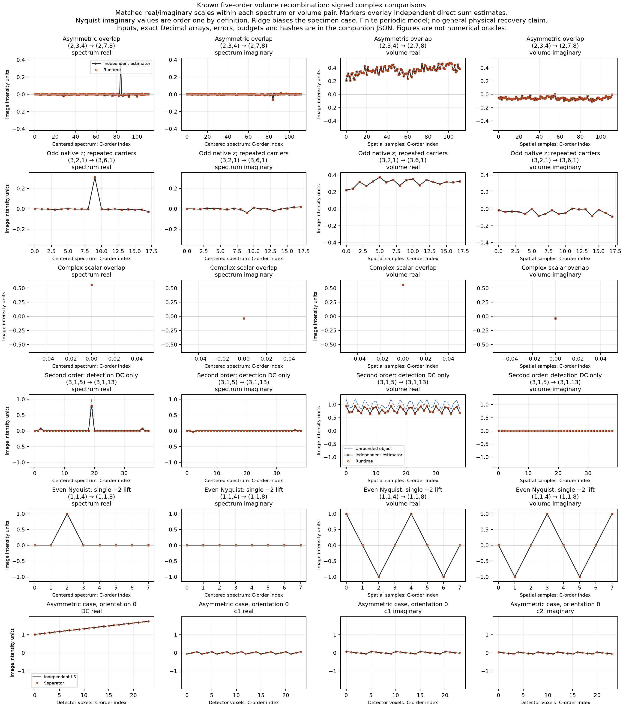

# Measured five-order volume comparison

The runtime agrees with independent stored-input least-squares and direct Fourier sums in five informative cases. Maximum measured complex-modulus errors are `4.44e-16` for spectrum and `4.82e-16` for volume, in image intensity units. These comparisons establish agreement with the [defined finite estimator](../contracts/volume-recombination-v1.md); they do not establish general physical recovery.

[Numerical JSON](volume-recombination-comparison.json) contains every input array, order transfer and coordinate, converted-data oracle, actual output, representative phase components, exact Decimal expectation pairs, budgets and hashes. [PNG](volume-recombination-comparison.png) and [SVG](volume-recombination-comparison.svg) show signed real and imaginary components. Each real/imaginary pair shares its scale. C-order flattening retains all z planes. The last row shows independently compared phase components for orientation zero. Figures are not numerical oracles.



## Inputs and independent expectations

The revised accepted [fixture](../../tests/volume_reconstruction_fixture.py) supplies the independent oracle. It solves the represented phase matrix's normal equations using pivoted Decimal elimination, then accumulates negative-exponent forward and positive-exponent inverse finite sums. It uses converted float64 images and the exact represented basis `[1,cos(phi),sin(phi),cos(phi)²-sin(phi)²,2*cos(phi)*sin(phi)]`. Expected arrays are computed before calling `reconstruct_volume` and never derived from runtime outputs. Oracle precision is 75 decimal digits; modulus errors are evaluated at 90 digits against the unrounded Decimal pairs. JSON also stores their rounded complex128 arrays for rendering.

Every reported case passes the fixture's sufficient informative-regime checks. These checks are observer conditions, not runtime rejection thresholds. Spectrum budget is `65536*J*(N+M)*eps*B + 256*J*(N+M)*q`; volume budget is `P*beta_S + 16384*J*P*eps*B + 64*P*q`, with `J=5R`, detector count `M`, output count `P`, image maximum `B`, `eps=2^-52` and `q=2^-1074`.

| Case | Detector → output z/y/x | Carriers y/x; gains | Ridge; mask |
|---|---|---|---|
| Asymmetric complex overlap | `(2,3,4)` → `(2,7,8)` | `(1,-1),(-1,1)`; `0.75,1.5` | `0.5`; linear `0.1…1` |
| Odd native z, repeated carriers | `(3,2,1)` → `(3,6,1)` | `(-1,0),(-1,0)`; `0.75,1.5` | `0.5`; linear `0.1…1` |
| Scalar complex overlap | `(1,1,1)` → `(1,1,1)` | `(0,0),(0,0)`; `0.5,1.5` | `0.5`; `0.25` |
| Second order beyond detection DC | `(3,1,5)` → `(3,1,13)` | `(0,-2)`; `1` | `0.25`; `1` |
| Even-Nyquist signed lift | `(1,1,4)` → `(1,1,8)` | `(0,0)`; `1` | `0`; `1` |

Input voxel spacings are `(0.7,1.3,0.4)` micrometres. Output z remains native; lateral spacing preserves the field of view. The first four cases use seven phases `[0.05,0.82,1.9,2.71,3.48,4.65,5.61]` radians per orientation; Nyquist uses the first five. Asymmetric and odd-z observations include deliberate off-model phase residuals. Their arbitrary complex transfers are algebraic calibrations, not asserted physical optics. Transfer origin phases are already encoded; opaque labels and origin metadata do not cause additional rephasing.

| Case | Max spectrum error | Spectrum budget | Max volume error | Volume budget |
|---|---:|---:|---:|---:|
| Asymmetric overlap | `1.7661e-16` | `8.9254e-9` | `4.1081e-16` | `1.0077e-6` |
| Odd native z | `7.3283e-17` | `2.6790e-9` | `1.8427e-16` | `4.9149e-8` |
| Scalar overlap | `6.5171e-17` | `2.4465e-8` | `6.5171e-17` | `2.5229e-8` |
| Second order | `3.5065e-16` | `1.8558e-9` | `4.8221e-16` | `7.3199e-8` |
| Even Nyquist | `4.4409e-16` | `6.5484e-10` | `4.4409e-16` | `5.3842e-9` |

Values in tables are rounded for display. Exact errors, budgets and arrays are retained in JSON.

## Complex overlap and phase components

The scalar case uses observed bands `(dc,c1,c2)=(10,2-i,3+4i)` and `(2,-0.25+0.75i,1-0.5i)`. Their transfers are `(1+0.25i,0.5+0.25i,-0.25+0.5i)` and `(0.7-0.2i,-0.5+0.4i,0.2+0.3i)`. Unequal gains and full conjugate-transfer weighting produce a complex result. Replacing transfers by magnitudes changes this estimator.

For the asymmetric case, orientation-zero voxel `(0,0,0)` has the following measured phase components. They are observed-volume harmonics, not specimen Fourier coefficients.

| Component | Actual value | Maximum error across that band's detector voxels |
|---|---|---:|
| DC | `1.0129407398410801` | `6.9048e-16` |
| c1 | `-0.06271399555508851 + 0.06974866235962646i` | `1.7751e-16` |
| c2 | `-0.0481191508783407 + 0.034402517570978085i` | `1.6827e-16` |

The JSON includes all three components, both real and imaginary parts, for every orientation and case, with independent represented-matrix least-squares expectations.

## Unrounded specimen truth versus rounded-data estimator

The second-order case uses uniform detection mass on `(3,1,5)`, `g1=0`, and `g2[z]=0.8*exp(2*pi*i*z/3)`. The finite circular forward model convolves each laterally modulated specimen with its effective kernel. The ideal uniform detection transfer has only DC. The second order instead passes detector mode `(1,0,0)`. Its transfer is approximately `0.8-1.38e-16i`; the supplied detection transfer at that detector mode is exactly zero.

With carrier `(0,-2)`, `q=j-2*carrier=(1,0,4)`. This lateral mode lies beyond the detector's canonical x window `[-2,2]`, and has usable second-order information. The unrounded real specimen is

```text
s(z,x) = 1 + 0.2*cos(2*pi*(z/3 + 4*x/13) + 0.3)
```

Here the formula is evaluated on the output grid; acquisition sampled the same mode with `x/5`. The selected coefficient in unrounded object truth is `0.1*exp(0.3i) = 0.0955336489125606 + 0.02955202066613396i`. The runtime returns `0.06869835427420087 + 0.021250891265534543i`. Its nominal ridge factor is `0.8²/(0.8²+0.25) = 0.7191011235955057`. DC is attenuated by `1/(1+0.25)=0.8`.

The actual maximum errors against unrounded object truth are approximately `0.2000000000` in spectrum and `0.2561659138` in volume. They are separate from the much smaller rounded-data estimator errors in the table. The figure's dashed blue line shows object truth and makes this bias visible. Real-input conversion, represented phases and computed calibration values also define the rounded stored problem; none are silently replaced by ideal values in the independent estimator comparison.

This finite example identifies a useful second-order contribution. Periodic detector sampling can alias other extended signed modes onto the same measurements, so it does not uniquely identify a general extended object. Missing transfer, ridge, mask, noise and off-model observations introduce further ambiguity or bias. The effective-kernel physical interpretation requires an axial profile fixed relative to the focal plane and `g0=1`, as stated in the [effective-transfer contract](../contracts/volume-order-transfers-v1.md). No measured instrument, continuous optics or general physical super-resolution claim is made.

## Explicit even-Nyquist lift

For detector `Nx=4`, zero carrier, unit DC transfer and data `(1,-1,1,-1)`, the canonical Nyquist coefficient is at signed mode `kx=-2`. Output `Lx=8` retains that single coefficient. The defined volume is `exp(-2*pi*i*2*x/8)`. Actual sample `(0,0,1)` is `0-0.9999999999999996i`.

These order-one imaginary values are the estimator's selected lift, not numerical residue. Splitting the coefficient between positive and negative modes, duplicating it or taking a real part would implement a different interpolation convention. The signed spectrum panel shows no coefficient at the positive partner.

## Execution and identities

Evidence was refreshed against accepted checkpoint `3e8af6474da3a9a8455f5917823fcd4b774e25e1`, tree `660dd03570a842b407639e159f4206889fe48968`, after four fixture helpers were corrected to use exact Python integers for accepted dimensions. Fixture SHA256 is `c230ece93d158712f5ee5bd9859c82048db09f03d7f20ffb1703880e712c1083`; the test assertions and contract hashes are unchanged. The complete 259-example targeted run, including seven oracle controls, passes. These current public API observations are supplemental; they do not recreate test-first evidence.

The regenerated five-case records were compared with preserved previous evidence. Every numerical input, exact Decimal expectation, rounded oracle, runtime output, coordinate, phase component, object-truth array, metric and numerical byte hash is identical. Prior five-case numerical evidence remains materially applicable; prior checkpoint/fixture fingerprints are historical. The previous JSON SHA256 was `46ddc1ee003be126ba0811a2056be10d2b382abaa7e37bc6bb23297f147bea07`. Runtime and export source hashes are unchanged. Current JSON records the revised checkpoint, fixture/verdict/inventory fingerprints, new evidence-script labels and this measured equality result.

Computation used locked product Python `3.13.12`, NumPy `2.5.3`, SIMrecon `0.1.0`, on Darwin arm64. Rendering used a separately identified plotting-only environment: Python `3.13.12`, Matplotlib `3.11.0`, Pillow `12.3.0`, Darwin arm64. The renderer imports neither the runtime nor the oracle, reads only the stored numerical JSON, validates plotted array hashes and writes PNG/SVG. Plotting dependencies were not added to the product.

Public command labels use repository-relative paths:

```sh
PYTHONPATH=tests .venv/bin/python artifacts/volume-recombination-execution/c-comparison-generate-03.py
MPLCONFIGDIR=artifacts/volume-recombination-execution/c-mplconfig plotting-python artifacts/volume-recombination-execution/c-comparison-render-03.py
.venv/bin/python artifacts/volume-recombination-execution/c-usage-snippet-02.py
```

`plotting-python` denotes the separately recorded plotting interpreter. Private executable paths and command logs remain in ignored execution evidence. Generator/renderer scripts are task evidence in that ignored directory. The [standalone usage snippet](../usage/volume-recombination.md) was extracted and executed; its numeric inputs and outputs correspond to the second-order comparison.

JSON metadata hashes the contract, frozen tests/fixture, lock, product configuration, runtime/export source and prerequisite sources, plus generator and renderer. Each array carries shape, dtype and SHA256 of declared little-endian C-order bytes. Exact expectation hashes cover canonical JSON of flattened Decimal pairs and shape. All source labels remain opaque and unverified. This report contains actual measurements; it supplies neither a backend error theorem nor complete behavior evidence. Exact committed verification and independent review remain separate delivery requirements.
