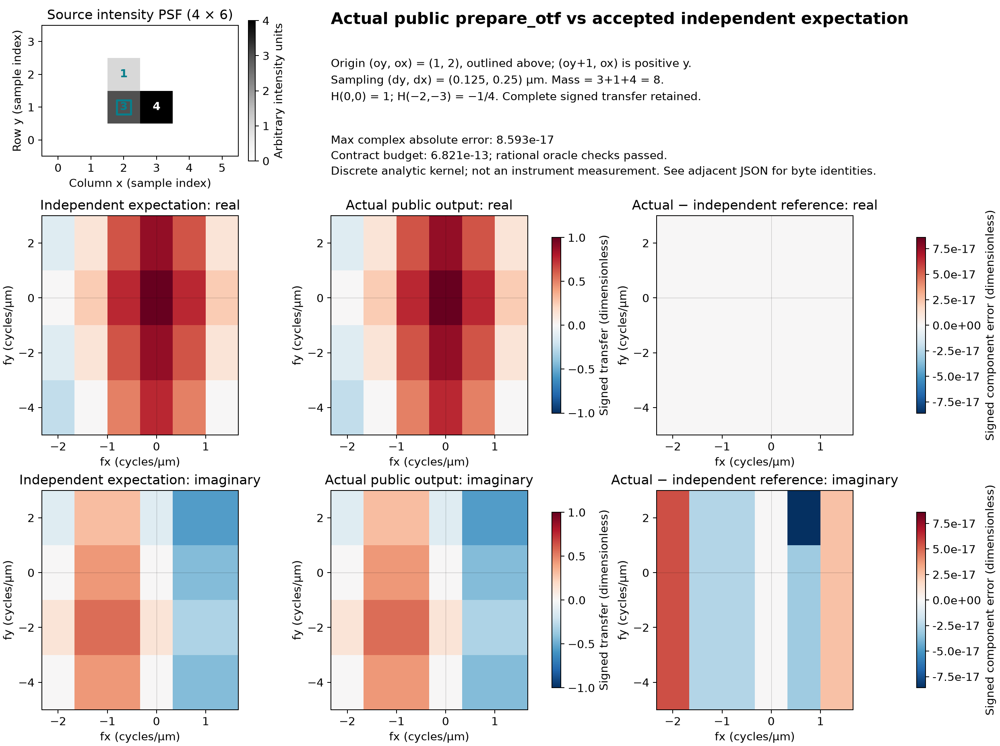

# Prepare a sampled 2D intensity calibration

`prepare_otf` converts a caller-supplied intensity point spread function (PSF) into its normalized optical transfer function (OTF). Supply the spatial sample sizes, origin and source label explicitly:

```python
import numpy as np
from simrecon import prepare_otf

psf = np.zeros((4, 6), dtype=np.uint8)
psf[1, 2], psf[2, 2], psf[1, 3] = 3, 1, 4
calibration = prepare_otf(
    psf,
    pixel_size_um=(0.125, 0.25),  # (dy, dx), micrometres
    origin_yx=(1, 2),           # zero-displacement sample (oy, ox)
    source="analytic example: masses 3, 1, 4",
)
```

All three keywords are required. `psf` must be a plain NumPy array with two positive spatial dimensions and a real integer or floating dtype. Samples must be finite and nonnegative before conversion. An independent float64 copy defines the stored problem; conversion overflow and zero converted mass are rejected. Conversion rounding and underflow can change the ratios between samples. Bool, complex and ndarray subclasses are rejected. Read-only arrays, reversed/strided views, either byte order, singleton axes and nonsquare grids are permitted.

Each coordinate pair accepts a tuple, list or plain one-dimensional NumPy array of length two. Pixel sizes must be real nonboolean scalars that convert to finite positive float64 values. Origin coordinates must be nonboolean integers inside the supplied grid; they are not rounded or wrapped. `source` must be a nonblank string. Its supplied text is retained verbatim as an opaque caller label.

The negative-exponential discrete Fourier transform uses unit discrete mass:

```text
p[y,x] = float64(psf[y,x]) / sum(float64(psf))
H[ky,kx] = sum p[y,x] * exp(-2*pi*i*(ky*(y-oy)/Ny + kx*(x-ox)/Nx))
fy = ky/(Ny*dy), fx = kx/(Nx*dx)     [cycles/µm]
```

The equation describes exact arithmetic on converted samples. Production normalization scales before summing to avoid raw-sum overflow. No pixel-area factor or transform factor `1/(Ny*Nx)` follows the sum. Absolute brightness/throughput is discarded. Common gain preserves the transfer when converted sample ratios remain the same.

`calibration.values` contains the complete signed complex128 transfer in `fftshift` order: modes `[-floor(N/2), ..., ceil(N/2)-1]` on each axis. The zero-frequency value is at `(Ny//2, Nx//2)`. `fy_per_um` and `fx_per_um` are matching float64 frequency vectors in cycles/µm, not radians/µm. Even axes include the negative Nyquist endpoint without a duplicate positive endpoint. Increasing spatial rows and columns mean increasing physical y and x; `(oy+1, ox)` is positive y. The figure below displays rows increasing upward.

For the example, mass is `3+1+4=8`, so `H(0,0)=1`, `H(1,0)=7/8-i/8`, and `H(-2,-3)=-1/4`. Negative real values and phase are part of the result. Magnitude, squared magnitude and inferred recentering would change the operation.

`Otf2D` freezes its attribute bindings. Its three arrays are C-contiguous, independently owned and mutable; they alias neither the inputs nor each other. Inputs stay unchanged on success and rejection. Direct construction of `Otf2D` performs no validation, so arbitrary records do not certify preparation.

The [approved contract](../contracts/otf-calibration-v1.md) specifies error codes on `SimreconError`, a `ValueError` with `code` and `message`. Invalid inputs, nonrepresentable frequency vectors, handled numerical transform failures and nonfinite transfer results reject the whole call. `MemoryError` and unrelated programming exceptions propagate. Handled arithmetic preserves the caller's NumPy floating-error policy and emits no arithmetic `RuntimeWarning`.

Each complex transfer bin has the dimensionless absolute error budget `128*M*2^-52 + 4*M*2^-1074`, where `M=Ny*Nx`. Each frequency has the absolute budget `8*2^-52*abs(f_exact) + 2^-1074` cycles/µm. Final vectors must be finite, strictly increasing, and retain nonzero modes; valid spacing alone does not guarantee a representable grid. Singleton axes contain only zero and accept every finite positive converted spacing. These budgets promise neither relative accuracy near cancellation nor retention of every subnormal component.



The [standalone SVG](../figures/otf-calibration-product-comparison.svg) and [numerical/provenance manifest](../references/scientific/otf-calibration-product-comparison.json) compare actual public `prepare_otf` output with the accepted independent fixture's normalized rational sum and 110-digit root series. Real and imaginary panels share signed `[-1,1]` scales. Separate signed component error maps use a common scale; errors are calculated against the independent reference before display rounding. The maximum complex absolute error is about `8.59e-17`, below the `6.82e-13` budget for this 24-sample grid. Acceptance uses complex-magnitude error, not separate component thresholds.

The manifest records source samples, sample-byte hash/dtype/layout, origin, spacing, units, preprocessing, operation source-byte hashes, frozen test/fixture/contract identities, lock identity and actual product/plotting environments. Product calculations use the locked product environment; a separate Matplotlib environment renders both assets from the same JSON and figure. The ignored one-off generators are local evidence rather than shipped tools. The final committed candidate and verification receipt belong in external execution evidence, not inside the tracked manifest's own bytes. Recreating outputs after operation-source changes requires regenerating this comparison.

This is a finite discrete periodic kernel, not measured instrument calibration or a guarantee about an infinite-field continuous optical response. Grid boundaries are not an inferred optical cutoff. Small, zero and out-of-ideal-support values remain. Preparation does not correct background, infer an origin, fit beads, mask support, pad, crop, interpolate, resample, reconstruct, or access files. The source label is not authenticated provenance: maintain your own source-array identity, instrument/model parameters, preprocessing, units, origin choice and resolved software versions. The earlier [intake preview](../figures/otf-calibration-intake-preview.png) is an external optical illustration and contains no product outputs. Neither illustration substitutes for full contract testing or independent candidate review.
